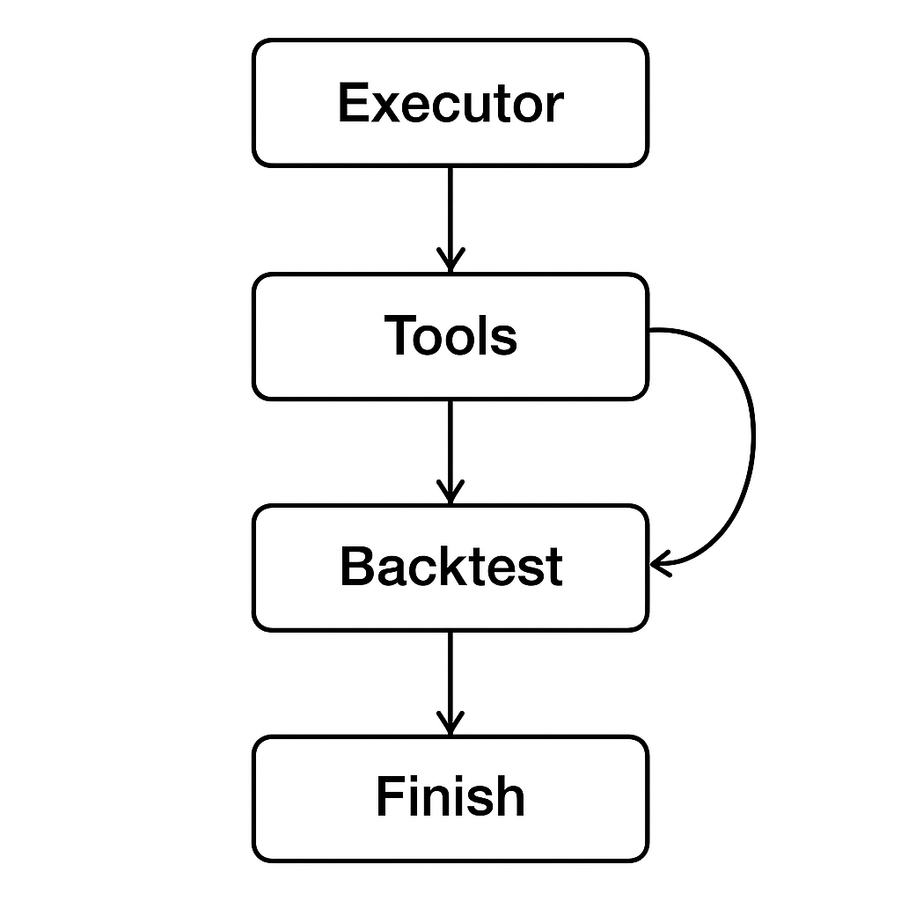
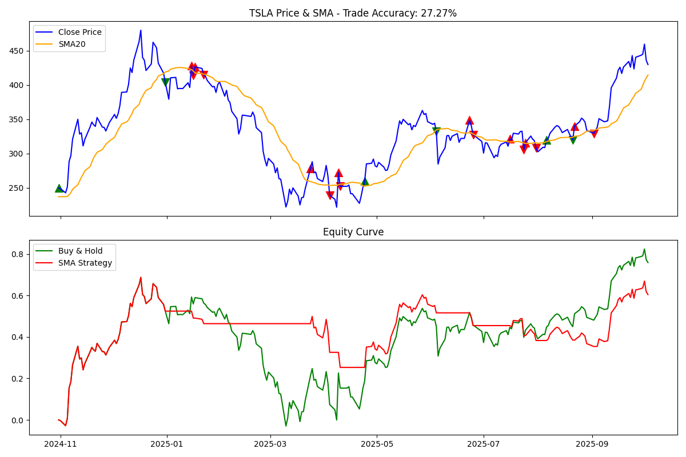

## Financial Trading Agent (LangGraph + OpenAI)

An autonomous financial trading agent powered by LangGraph, LangChain, and OpenAI, capable of executing financial analysis tasks such as fetching stock data, calculating indicators (like SMA/RSI), and running strategy backtests automatically through iterative reasoning.

## Flow diagram on the graph :



## Example Agentic Run for TSLA (Tesla) :


## Instructions to Run
Step 1: Clone this Repo
```bash
git clone https://github.com/rejith77/SMA-Trading-Agent
cd SMA-Trading-Agent
```

Step 2: Build the image
```bash
docker build -t simple-trading-agent .
```
Step 3: Run the Agent
```bash
docker run --rm -it -v $(pwd)/charts:/app/charts simple-trading-agent
```
